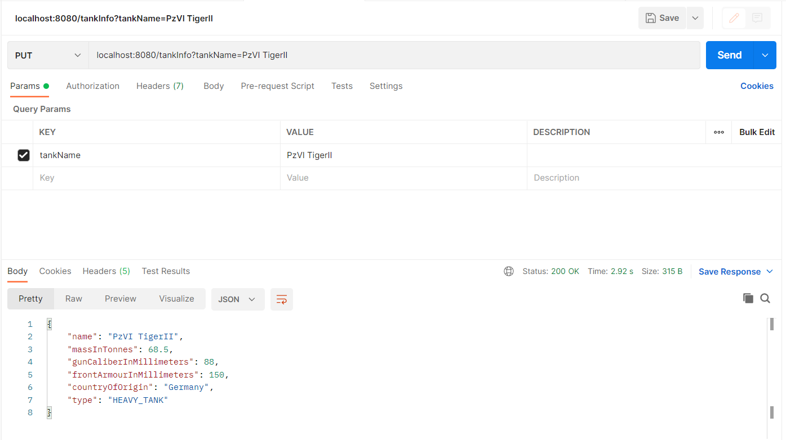
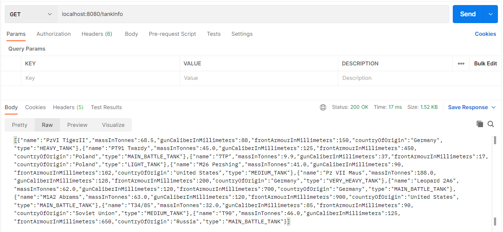
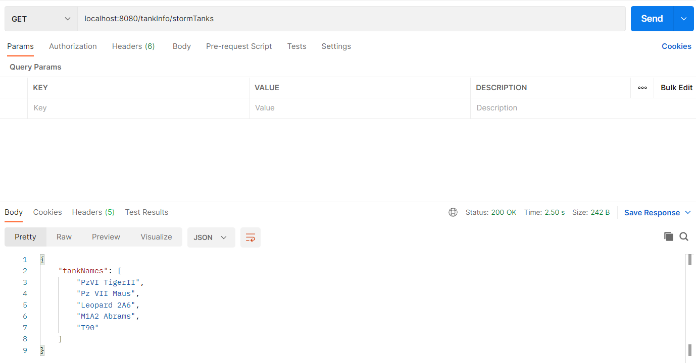
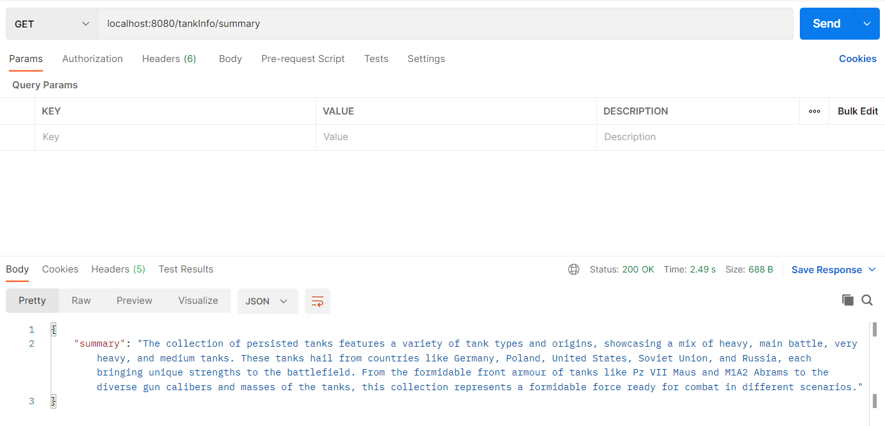

# AI Demo

## Description

Demo project for Langchain4j library and Spring Boot integration.

Langchain4j is a Java library designed to facilitate the development of applications leveraging large language models (LLMs) and integrating natural language processing (NLP) capabilities. Inspired by the LangChain framework, which is popular in the Python ecosystem, Langchain4j aims to provide similar functionalities for the Java programming environment.

## Getting Started

These instructions will get you a copy of the project up and running on your local machine for development and testing purposes.

### Prerequisites

To properly build an application one might need to install [Java 17](https://www.oracle.com/th/java/technologies/downloads/#java17) and/or [Docker](https://www.docker.com/get-started/).

### Cloning

```
$ git clone https://github.com/ninjarlz/aidemo
```

### Building

Using the installation of Java 17 and built-in gradle wrapper:
```
$ ./gradlew build
```
Additionally, one can build & run application using provided [Dockerfile](Dockerfile).

## Configuration

Contains configuration for:
* **locally hosted LLM (llama3.1)**: 
  * *'ollama'* Spring profile defined in *application-ollama.yml* file: 
    ```
    langchain4j:
      ollama:
        chat-model:
          model-name: llama3.1
          temperature: 0.2
          base-url: http://localhost:11434
          format: json
          timeout: 1200s
    ```
  * one can use [ollama/docker-compose.yml](docker-dev/ollama/docker-compose.yml) file to run the required PostgreSQL database with locally hosted llama3 LLM.

* **cloud-based ChatGPT 3.5**:
  * *'chatgpt'* Spring profile defined in *application-chatgpt.yml* file:
    ```
    langchain4j:
      open-ai:
        chat-model:
          api-key: ${OPEN_AI_API_KEY}
          model-name: gpt-3.5-turbo
          temperature: 0.2
          log-requests: true
          log-responses: true
          response-format: json_object
          timeout: 1200s
    ```
  * one can use [chatgpt/docker-compose.yml](docker-dev/chatgpt/docker-compose.yml) file to run the required PostgreSQL database.
  * one has to provide one's own Open AI API key exposed as *OPEN_AI_API_KEY* environmental variable.

## Implementation

### Interactions with LLM

Composition of the following annotations (`@AiService`, `@UserMessage` and `@SystemMessage`) makes it possible
to interact with the given LLM solution:

```
@AiService
public interface TankAiAssistant {

    @UserMessage("Give me information about tank with name {{tankName}}. Do not execute tool.")
    TankDTO describeTank(@V("tankName") String tankName);

    @UserMessage("Prepare concise and interesting summary about persisted tanks. " +
            "Summary should cover different aspects of tanks.")
    TankSummaryDTO summarizeTanks();

    @UserMessage("Identify names of best tanks for participating in storm (or front attack on densely defended positions) " +
            "within set of persisted tanks.")
    @SystemMessage("Storm tanks are characterized by huge gun and thick front armour.")
    TankNameListDTO identifyStormTanks();
}
```

The first method is used to scrap tank data from a chosen AI solution. Then, a set of persisted data (scrapped data is saved to the database by another service)
can be analyzed using two other methods. LLM can access the database data thanks to the `@Tool` annotation described in the next section.

### Giving LLM access to the codebase

It is possible to allow LLM to execute Java code using `@Tool` annotation. 

```
@Component
@RequiredArgsConstructor
public class TankTool {

    private final TankService tankService;

    @Tool("Get data of persisted tanks for summary and analysis.")
    public List<TankDTO> getPersistedTanksData() {
        return tankService.getAllTanks();
    }
}
```
In our example, LLM is able to fetch persisted tank data from the database for performing further analysis.

## Usage

### Scrapping & persisting information from LLM

* To scrap new tank information from LLM and save data to the database:
`PUT localhost:8080/tankInfo?tankName=PzVI TigerII`


### Fetching persisted data
* To fetch scrapped data that were persisted in the database:
`GET localhost:8080/tankInfo`


### Analysis of persisted data
* To make LLM select the name of storm tanks from the set of tanks persisted in the database:
`GET localhost:8080/tankInfo/stormTanks`

* To make LLM prepare short summary about the set of tanks persisted in the database:
`GET localhost:8080/tankInfo/summary`


## Built with
* [Spring Boot](https://spring.io/projects/spring-boot) - The world’s leading Java web app creation platform
* [Langchain4j](https://docs.langchain4j.dev) - A Java library designed to facilitate the development of applications leveraging large language models (LLMs) and integrating natural language processing (NLP) capabilities.

## Developers
* **Michał Kuśmidrowicz** - [ninjarlz](https://github.com/ninjarlz)

## License
This project is licensed under the MIT License - see the [LICENSE.md](LICENSE.md) file for details
